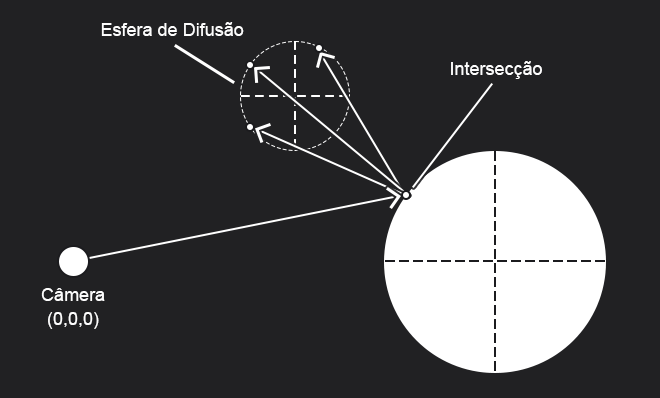

# Capítulo 10 - Metal

Aqui utilizaremos a base construída no capítulo anterior na implementação de um novo material, o metal. Não há nenhum aspecto que não seja coberto pelo livro nesse capítulo ou em anteriores. Apesar disso, o conceito de reflexão utilizando uma esfera de difusão (Fuzzy Reflection) pode ser de grande ajuda quando é preciso definir o grau de polidez de um objeto.

## Reflexão por Esfera de Difusão

O livro detalha bem o algoritmo de criação desse efeito, mas não diz muito sobre sua utilidade. Esse processo tem como principal objetivo dar a materiais polidos um pouco das característas de um material difuso, dado seu nível de polidez.

Na imagem a baixo pode-se notar que embora o raios fluam através de pontos sobre a esfera, eles não necessariamente tem direções randômicas, os raios se concentram sobre o eixo da reflexão especular, e, dependendo do tamanho da esfera de difusão, podem se manter muito próximos a ele em esferas pequenas, ou dispersos chegando próximo ao comportamento de um material difuso, mas nunca sendo igual. 

