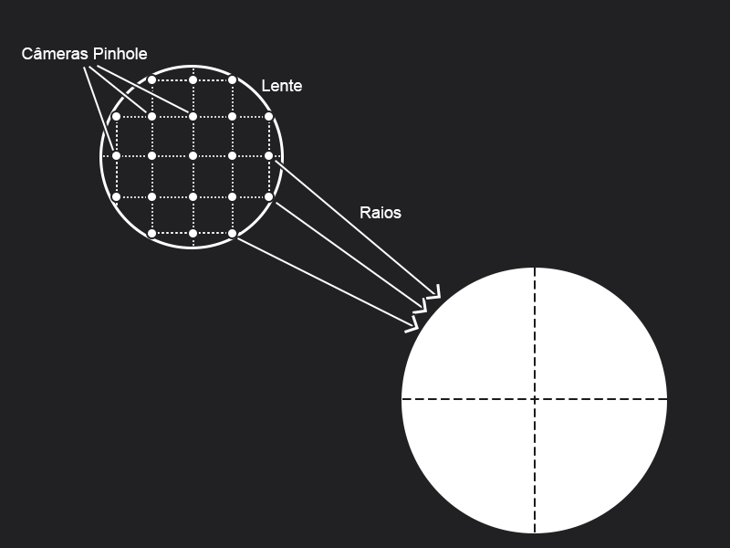
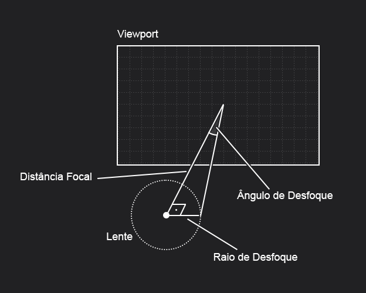
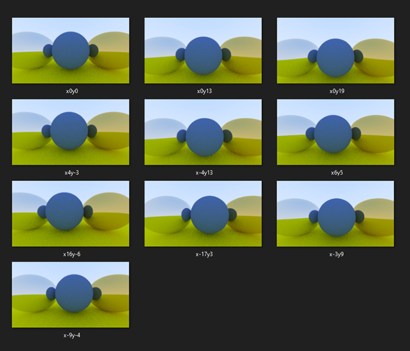
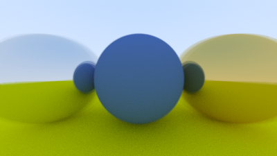

# Capítulo 13 - Defocus Blur

Esse é o último capítulo que lida com conceitos de renderização e, na minha opinião, o mais difícil de se entender por completo, já que os tópicos abordados não são bem aprofundados e o conteúdo sobre o tema é escasso na internet. Nessa nota iria explicar toda a informação que consegui obter e que, possivelmente, pode esclarecer o que acontece nesse capítulo.

## Câmera Pinhole

Atualmente esse é o estilo de câmera que usamos para renderizar nossas imagens. Uma câmera pinhole (buraco de alfinete) é uma compartimento escuro que possui um único furo para entrada de luz e um papel fotográfico do lado contrário à esse furo. Nesse estilo de câmera a luz atravessa um único ponto, o buraco, que, no nosso código, é a posição da câmera. É importante ressaltar que embora em nosso *ray tracing* os raios saiam da câmera, esse feito visa simular o que acontece no mundo real, mas percorrendo o caminho inverso da luz.

Uma câmera pinhole é bem conhecida por ter seu *depth of field* (campo de profundidade) quase infinito, assim conseguindo obter imagens nítidas sem que nenhum defoque ocorra. Apesar disso, elas possuem um defeito que as deixa inviável para uso comum, o tempo para captura de imagem.

Por possuir um buraco de entrada extremamente pequeno é necessário um maior tempo de exposição à luz para que um imagem possa ser gerada, indo de 5 segundos até horas. Isso ocorre pela dificuldade de captura de fótons devido ao tamanho do buraco. Por causa disso, câmeras com uma entrada de luz maior têm maior uso, mesmo apresentando problemas com o desfoque.

O optar por uma câmera pinhole também pode ter um efeito negativo em nosso *ray tracing*, já que as imagens geradas tendem a não ser muito realistas e passam a visão de uma imagem computacionalmente gerada, muito disso devido ao foco absoluto.

## Outros Estilos de Câmeras

Se o principal problema das imagens geradas vem do fato de não possuirem um desfoque, então optar por um modelo de câmera com lente é um boa opção. O fator de interesse na arquitetura dessa câmera é que a luz tem mais facilidade para ser capturada devido ao buraco de entrada ser maior.

Como no *ray tracing* fazemos o caminho inverso então ao invés de pensarmos na entra de luz por diversas partes diferentes do buraco, disparemos raios por pontos diferentes em uma certa distância do posicionamento original da câmera. Também alteremos a trajetória do raio baseado nesse deslocamento de origem do disparo. 

## Entendendo o Desfoque

É relativamente fácil entender o que está sendo feito, mas talvez a questão principal seja: **Porque isso produz desfoque?**. Uma boa ideia para entender isso é imaginar que a lente (região que disparará os raios) pode ser representada como um conjunto de câmeras pinhole:

Claro que as câmeras não necessariamente estarão alinhadas e colocadas equidistantes uma das outras, isso é apenas para compreensão, na verdade elas ocuparão todo o espaço da lente na vertical e horizontal. Outro fator diferente da imagem é que o tamanho da lente, que será apenas uma fração do tamanho do viewport (na grande maioria dos casos), não sendo tão grande quanto a representada na imagem.

As câmeras também não utilizaram um viewport compartilhado, cada uma terá seu próprio viewport, mas não será criado nenhum viewport adicional. O que acontecerá é um redirecionamento da trajetória do raio, baseado no deslocamento da câmera, tentando emular um novo viewport através do original. A melhor maneira de visualizar isso é pensar que um viewport também sofrerá o mesmo deslocamento que sua câmera.

A partir disso, uma porção de imagens levemente deslocadas uma das outras pode ser gerada, podendo ser interpoladas dado o deslocamento feito na horizontal e vertical de cada uma, o que culmina no efeito de desfoque.

É interessante ressaltar que a implementação não produz varias imagens, mas utiliza a técnica já implementada de antisserrilhamento (antialiasing) na interpolação de cada pixel da imagem. Nesse caso, só o pixel foco é gerado a cada deslocamento é o valor médio de todas as amostras é calculo como valor de pixel (igual ao antialising), assim sendo um processo de custo zero dado o antialiasing já em execução. Esse processo também pode ser conhecido por **Synthetic Aperture Photography** ou **Synthetic Aperture Imaging**.

Para ilustrar esse processo, na próxima sessão será utilizado o *ray tracing* preparado antes desse capítulo em conjunto com um editor de imagem para produção de um efeito de desfoque "feito à mão".

## Criando o Efeito de Desfoque

Como editor de imagem utilizarei o **Photoshop 2021**, mas você poderá utilizar o de sua preferência caso queira testar por você mesmo.

Primeiro serão geradas 10 imagens com deslocamentos diferentes para cada uma, sendo a primeira delas com deslocamento 0 em todos os eixos. Para essa imagem, a câmera será colocada na posição original (0,0,0) olhando para (0,0,-1) e, para facilitar o processo, a distância focal de 1 será assumida. O *vup* também pode permanecer em (0,1,0) já que não haverá rotações na câmera.

O tamanho da lente é dado pela tangente do ângulo de desfoque vezes a distância focal ($raio = tan(ângulo) * distância focal$), como mostrado na ilustração a baixo:

Veja que quanto maior o ângulo, mantendo a distância focal, maior o raio da lente e, por consequência, maior o desfoque. Assumirei o ângulo de 10° ($\frac{\pi}{18}$), mas como no livro esse ângulo é divido por 2, pois leva em conta o ângulo completo (não apenas o que está em uma das partes dividas pela distância focal), nosso ângulo será o equivalente ao ângulo de desfoque de 20° ($\frac{\pi}{9}$) da implementação do livro.

Com isso em mãos, só nos resta saber o deslocamente feito em pixel da câmera para cada imagem gerada. Sabendo o tamanho do deslocamente feito para cada raio da viewport (que representam cada pixel da imagem) é possível descobrir O valor equivalente a um pixel dividindo o tamanho da viewport pela quantidade de raios que a atravessam (ignorando o antialising, a quantidade de pixel). Como o deslocamente entre raios é igual tanto na vertical quanto na horizontal, você pode escolher qualquer uma delas para fazer o calculo a cima, Apesar desse processo não ser perfeito devido aos arredondamentos, esses valores podem servir como uma boa base para conserto manual.

Para facilitar, o nome de cada uma das imagem é composto por **x\<deslocamento horizontal\>y\<deslocamento vertical\>**, onde os deslocamento estão em pixel, e podem ser encontradas na pasta **defocusBlurExample**. O código de geração de imagens pode ser encontrado na pasta **Chapter 13** e no arquivo **defocusBlurExample.ts**.

Ao interpolar cada uma dessas imagens em um programa de edição, com os devidos deslocamento e suas correções manuais, fazendo a média de cor para cada pixel, podemos obter algo parecido com a imagem a baixo, onde claramente a bola azul está sendo focada enquanto as outras estão em contínuo desfoque.

### Possíveis Erros

#### Deslocamento em editores de imagem

Editores de imagens geralmente possuem o eixo y invertido, que ocorre pela falta de normalização da tela. Isso é útil no uso da ferramenta no geral, mas pode causar uma pequena confusão no nosso caso, gerando muito mais desfoque que o necessário nesse eixo.

Para resolver esse problema inverta o deslocamento em y presente no nome do arquivo na ferramenta de edição, onde o negativo ficará positivo e o positivo negativo. Isso negará a inversão do eixo vertical do editor.

#### Interpolação das Imagens

Para fazer essa interpolação no *Photoshop 2021* é necessário unir todas as camadas em um **objeto inteligente** e ir no menu **Camada > Objeto Inteligente > Modo de Pilha > Valor médio**. Isso calculará a média de cor para cada pixel da imagem não transparente, gerando nossa imagem final. Esse processo deve ocorrer após o deslocamento de todas as imagens.

Apesar de parecer mais fácil, você não poderá simplesmente utilizar a opacidade para fazer esse efeito já que a opacidade da câmada atual é dada pela multiplicação dessa pelas opacidades das camadas anteriores. Um exemplo com três camadas onde cada uma tem 33% de opacidade pode ser visto a baixo:

- **Opacidade da Camada 1**: 0.33; **Opacidade Real**: 0,33
- **Opacidade da Camada 2**: 0.33; **Opacidade Real**: 0,33 * (Opacidade da Camada 1) = 0.10
- **Opacidade da Camada 3**: 0.33; **Opacidade Real**:  0,33 * (Opacidade da Camada 1) *  (Opacidade da Camada 2) = 0.03

No final, a opacidade total é de $0.33 + 0.1 + 0.03 = 0.46$, diferente do esperado 1, o que inviabiliza essa estratégia.

## Observações

A ideia para a criação do exemplo vem de uma das atividades da *Northwestern University* que utilizam a câmera de um celular para filmar uma cena e, a partir do processamento dos frames, criar uma imagem com desfoque. Além disso, uma discussão no *Reddit* também foi muito útil para um entendimento geral do tópico, inclusive recomendando a atividade a cima.

- [HW6: Synthetic Aperture Imaging](http://users.eecs.northwestern.edu/~ollie/eecs395/HW6/HW6.htm)
- [Reddit: Ray tracing in a weekend depth of field](https://www.reddit.com/r/GraphicsProgramming/comments/c35jmw/ray_tracing_in_a_weekend_depth_of_field/)

