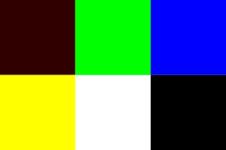
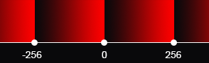

# Capítulo 2 - Output an Image

Para saída de imagem o autor optou pela extensão **PPM** que é encodada no formato ASCII, sendo uma boa opção já que a saída do programa é escrita diretamente na console e redirecionada imediatamente para um arquivo de imagem.

Apesar de ser um bom négocio, essa estratégia não é muito útil já que a biblioteca *Jimp* está sendo utilizada. O formato padrão nesse repositório será o **PNG**, pois ,além de ser um formato amplamente utilizado, é o padrão gerado pelo Jimp.

Embora a diferença de extensão, isso não afetará o resultado final ou a codificação, já que o tratamento dado os *buffers* no Jimp é semelhante à interpreção dos dados da console no PPM.

## Formato do Pixel

Para ambos os casos (intepretação direta do PMM e buffer do Jimp) os valores para cada canal (vermelho, verde e azul) do *pixel* devem estar entre **0** e **255**, sendo 0 a ausência do canal e 255 a presença máxima do mesmo. Mesmo com essa semelhança, a biblioteca exige que o *buffer* possua 4 valores para cada pixel (formato PNG), os indicares de cada canal e um valor alpha de transparência que não será usado e é implementado diretamente na classe **JimpLib**.

Contudo, tanto o PMM quanto o Jimp aceitam valores superiores a 255 para cada indicador de canal o que talvez gere dúvidas quanto a interpretação da extensão e biblioteca em certos capítulos.

### Interpretação - PPM

A [especificação do PPM](https://netpbm.sourceforge.net/doc/ppm.html) descreve brevemente o conteúdo de um arquivo PPM como:

- **"Número mágico"** (P3 ou P6 para a extensão .ppm);
- **Largura** e **Altura** em decimais positivos, separados por um espaço em branco;
- **Maxvalue**, valor máximo de um canal (deve ser menor que 65536 e maior que 0);
- **Bitmap do contéudo**, pares de três canais que serão interpretados do canto superior esquerdo até o canto inferior direito linha a linha, onde cada uma delas possui a largura indicada.

Um exemplo, também citado no livro, pode ser obtido acessando o [Wikipédia](https://en.wikipedia.org/wiki/Netpbm):

```bash
P3 
3 2
255
255   0   0
  0 255   0
  0   0 255
255 255   0
255 255 255
  0   0   0
```

Gerando:


Embora exista um grande número de informações na documentação, não existe nenhuma informação sobre o comportamento do arquivo ao encontrar valores maiores que o Maxvalue na descrição da cor de um pixel.

#### Testes

Para verificar isso, uma pequena modificação do arquivo de exemplo pode ser feita, modificando a cor vermelha do primeiro pixel na tentativa de gerar um *overflow*:

```bash
P3 
3 2
255
300   0   0
  0 255   0
  0   0 255
255 255   0
255 255 255
  0   0   0
```



O resultado mostra que não há corrupção no arquivo e que o valor vermelho do primeiro pixel pode ser dado pelo byte menos significativo (*least significant bit*, LSB) do número. Isso ocorre somente quando o Maxvalue é menor do que 256, caso contrário esse número poderá ser representado com 2 bytes e pode chegar a até 65535.

Nesse caso o número 300 poderia facilmente ser substituido por 44, já que uma forma de representar essa operação é utilizando a operação módulo , onde 300 % 256 = 44.

### Interpretação - Jimp

Igualmente ao PPM, o Jimp possue o mesmo sistema para valores a cima de 256, mas consegue ser mais leniente para valores negativo de buffers que não podem ser representados pelo PPM.

Nesse caso, o melhor jeito de entender a intepretação do canal é visualizando-o através de um reta, onde, seja **N** o valor de um canal, se **N < 0** o valor será 255 - (N % 256) se **N >= 0** o valor será N % 256, como mostrado na imagem a baixo:



Apesar dessa tolerância com número negativos, esse artifício não será utilizado no livro, já que o PPM não suporta tais valores. 

## Observações

Caso utilize outra biblioteca para processamento de imagem ou redirecione a saída pra outro formato, confira a documentação ou especificação do mesmo, porque existe chances de haver resultados inesperados na saída. Considere implementar os comportamentos citados manualmente caso seja necessário em sua própria implementação da interface *IImageLibrary*.