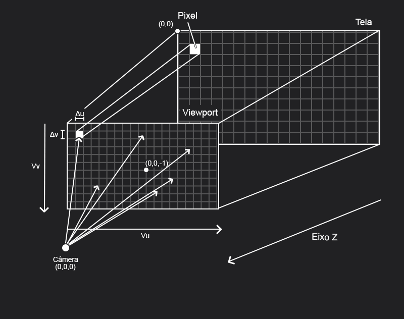

# Capítulo 4 - Rays, a Simple Camera, and Background

Nesse capítulo são introduzidos os conceitos de raio, câmera e *viewport* que, embora sejam bem simples, exigem uma visualização cautelosa já que esses conceitos serão usados tanto nos próximos capítulos quanto nos próximos livros.

## Raio

O raio é a estrutura central do *Ray Tracing* sendo a soma do vetor de origem $A$ e vetor de direção $B$ multiplicado por uma escalar, dessa forma, $P(t)=A+tB$ é a função que define um raio $P$ dado uma escalar $t$, sendo $A$ e $B$ fixos.

É importante ressaltar que diversos raios serão emitidos a partir de uma origem (câmera), portanto $A$ se manterá fixo na maior parte do tempo, mas $B$ irá variar para cada angulação desse raio. Além disso, a compreensão da variável $t$ será fundamental, pois ela decidirá em que momento do raio um dado objeto colidirá com vetor.

## Câmera

A câmera será o local de onde os raio irão partir, ela é descrita como um ponto no plano 3D da cena e possui uma distância do *viewport* conhecida como **distância focal** (*focal length*).

## Viewport

Acredito que a maioria das pessoas, principalmente aquelas que nunca tenham visto nada sobre computação gráfica, tenham dificuldade de entender o que seria um *viewport* e sua utilidade. De maneira geral, o *viewport* é uma representação virtual da tela onde a imagem será renderizada e está dentro do mundo 3D. Apesar disso, essa representação não ocorre pixel por pixel baseado no tamanho da tela original, o que pode gerar um questionamento sobre o porque e de que forma isso ocorre.

Para entender isso é preciso lembrar que estamos trabalhando com vetores que são normalmente representados a partir de um mapa cartesiano cujo centro é o ponto (0,0), algo extremamente diferente da representação normal de uma tela que tem seu ponto (0,0) no canto superior esquerdo. Esse fato exige que uma transformação seja feita no espaço para se adequar ao novo paradigma.

Com foco em mudar a posição do ponto (0,0), um processo de normalização de tela ocorre, subtraindo metade da largura e somando metade da altura para transferir o ponto para o centro da tela. Além disso, por causa das mudanças citadas e para evitar *overflows* de floats e doubles, não é necessário manter a largura e altura padrão da tela na representação, apenas a proporção da tela.

Os vetores/pontos que representam cada pixel também tem a função prática de ditar a direção dos raios na cena, representando o $B$ na função do raio. Você pode encarar o viewport como uma forma de limitar a visão da câmera já que, por ser um ponto, ela pode lançar raios para todas as direções possíveis. 

## Visão geral

Essa imagem exemplifica como a interação entre essas partes irá funcionar:


### Otimização do Cálculo de Direção do Raio

Algo que me incomodou na implementação é que para encontrar o canto superior esquerdo do nosso viewport é preciso acrescentar a posição da câmera ao cálculo.

```typescript
    const topLeftCorner = Vec3.sum(
      cameraOrigin, // posição da câmera
      Vec3.scalarMult(halfHorizontal, -1),
      Vec3.scalarMult(halfVertical, -1),
      focalVec
    );
```
Isso não faz sentido já que na equação do raio ($P(t)=A+tB$), o canto superior esquerdo somado ao deslocamento horizontal e vertical no viewport será $B$, enquanto A será posição inicial do raio, que é "coincidentemente" a posição da câmera. Esse fato é confirmado na criação do raio, onde a implementação é feita da seguinte forma:

```typescript
    const rayPixel = Vec3.sum(
      topLeftCorner,
      horizontalViewportPercent,
      verticalViewportPercent,
      Vec3.scalarMult(cameraOrigin, -1) // posição da câmera
    );

    return new Ray({
      origin: cameraOrigin,
      direction: rayPixel,
    });
```

Caso isso não sejá feito, então $P(t)=A+t(B + A)$ que resulta em $P(t)=(t+1)A+tB$ que não representa apropriadamente o raio. Esse fator pode ser ignorado iniciamente já que a posição da câmera é o ponto (0,0,0), fazendo a equação do raio ser $P(t)=tB$, mas que se torna útil nos proxímos capítulo , principalmente pela movimentação na câmera.

Esse caso gera uma pergunta: **Porque fazer essa soma?**. É possível retirar a soma inicial da posição da câmera (assim como remover sua subtração) sem que haja consequências para isso. Como a substração ocorre para todo pixel da tela e possui 3 operações em vetores 3D (uma para cada eixo), então, para uma imagem de 400x225 teriamos 270.000 + 3 (operações de adição) operações a menos para cada imagem gerada, uma otimização relativamente boa e que fica ainda melhor com o aumento do tamanho da imagem.

## Observações

No livro o autor cita :

>Our pixel grid will be inset from the viewport edges by half the pixel-to-pixel distance. This way, our viewport area is evenly divided into width × height identical regions.

Apesar de não existir nenhuma motivação até o momento que exija esse acréscimo de metade da distância pixel-a-pixel, a ideia principal por trás disso é centralizar o raio dedicado à aquele pixel (sem isso o raio se encontrará no canto superior esquerdo do pixel).

A falta dessa implementação não gerará nenhuma dificuldade a curto prazo, e a motivação será explicada no **Capítulo 8 - Antialiasing**. Acredito que pela explicação não estar clara, essa parte pode gerar algumas dificuldades no entendimento, então, caso não se sinta confortável, não implemente-a.


