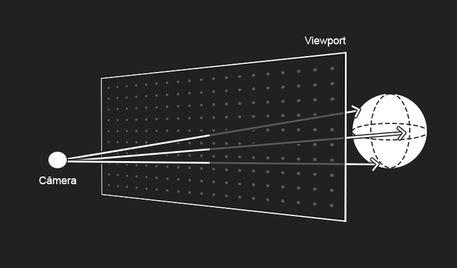
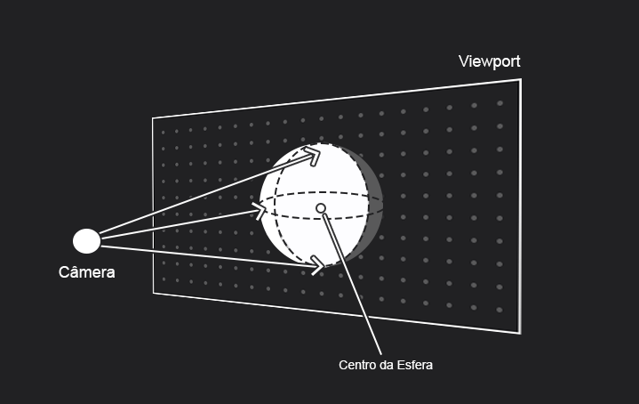
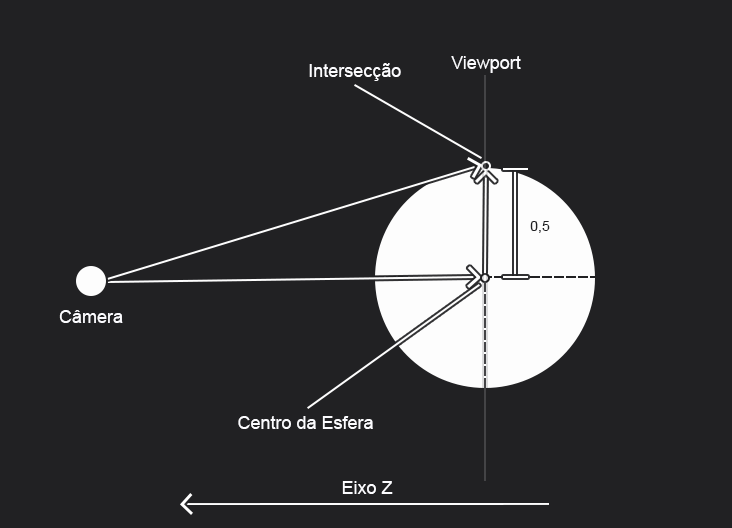
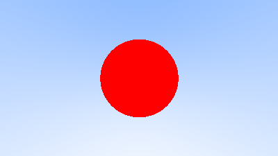
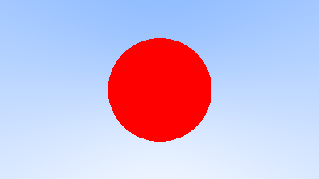
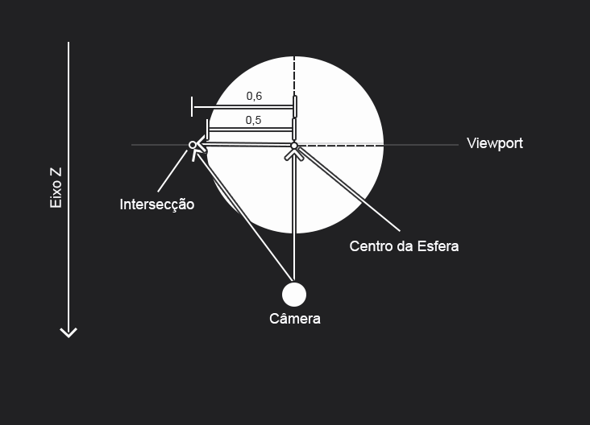

# Capítulo 5 - Adding a Sphere

A implementação de uma simples esfera vermelha em contraste com a gradiente azul e branco feito no capítulo passado. Embora estejam em arquivos diferentes, o *redSphere.ts* possue a mesma implementação do *blueWhiteGradient.ts*, mas agora com o código adicional que verifica a colisão com a esfera. Apesar dessa ideia de separação de código por capítulo possuir certos problemas como a repetição de código, usarei ela como uma forma de separar o aprendizado por etapas mais consistentes, facilitando revisões futuras.

## Colisão

Como citado nas notas anteriores, atiraremos raios que partirão da câmera em direção ao *viewport* e percorreram o mundo 3D podendo encontrar com objetos nesse trajeto. Uma visualização da ideia:



Em nosso caso, a figura é um pouco diferente, já que o *focal_length* e o centro da esfera estão na mesma distância da câmera no eixo Z. Apesar disso, a ideia permanece a mesma, além de ter alguns conceitos interessantes a serem abortado. Imagem do caso:




## Ideia do Livro

No livro, o autor indica uma maneira de verificar essa colisão utilizando a equação da esfera e a função do raio onde, caso exista um $t$ que satisfaça a igualdade entre essa duas fórmulas, então o raio colidiu com o objeto.

O autor começa escrevendo a fórmula da esfera em função dos vetores P (um ponto genêrico) e C (centro da esfera) de forma que:

$(P−C)⋅(P−C)=r²$

Além disso, como P deve ser alcançável atráves do raio dado um certo $t$, então:

$(P(t)−C)⋅(P(t)−C)=r²$

E utiliza propriedades do produto escalar para chegar na função quadrática final:

$t²B⋅b+2tB⋅(A−C)+(A−C)⋅(A−C)−r²=0$

### Dedução alternativa

Apesar de ser mais simples, a dedução da equação final ainda é possível sem o uso das propriedades do produto escalar. Para isso, é preciso perceber que o produto escalar é a multiplicação do tamanho de um vetor pelo tamanho da projeção do segundo vetor no primeiro. Como a projeção de um vetor nele mesmo é igual à esse vetor então: $P⋅P = ||P||²$

Com isso, temos:

$(P−C)⋅(P−C)=||P-C||²=r²$

Mas P é um ponto alcançável pelo raio, então:

$||A+tB-C||²=r²$

Desenvolvendo:

$(tB.x+A.x-C.x)²+(tB.y+A.y-C.y)²+(tB.z+A.z-C.z)²=r²$

$(t²B.x²+2tB.xA.x-2tB.xC.x-2A.xC.x+A.x²+C.x²)+
(t²B.y²+2tB.yA.y-2tB.yC.y-2A.yC.y+A.y²+C.y²)+
(t²B.z²+2tB.zA.z-2tB.zC.z-2A.zC.z+A.z²+C.z²)=r²$

$t²(B.x²+B.y²+B.z²)+t(2B.xA.x-2B.xC.x+2B.yA.y-2B.yC.y+2B.zA.z-2B.zC.z)+(-2A.xC.x+A.x²+C.x²-2A.yC.y+A.y²+C.y²-2A.zC.z+A.z²+C.z²-r²)=0$

Mas veja, essa última fórmula é igual a função quadrática. Reajeitando os membros:

$t²(B.x²+B.y²+B.z²)+t(2(B.x(A.x-C.x)+B.y(A.y-C.y)+B.z(A.z-C.z)))+((A.x-C.x)²+(A.y-C.y)²+(A.z-C.z)²-r²)=0$

Observe que:

$B⋅B=(B.x²+B.y²+B.z²)$

$2B⋅(A−C)=2(B.x(A.x-C.x)+B.y(A.y-C.y)+B.z(A.z-C.z))$

$(A−C)⋅(A−C)−r²=(A.x-C.x)²+(A.y-C.y)²+(A.z-C.z)²-r²$

Chegando na mesma conclusão que o desenvolimento do autor sem o uso das propriedades.

## Ideia de Subtração

Uma dúvida que surgiu nesse capítulo foi sobre a necessidade de uma função quadrática  para o caso, pois como a esfera está em cima do *viewport* uma simples verificação de tamanho de vetores seria o suficiente, já que a parte de trás da esfera não seria visualizada de qualquer forma devido à escolha do menor t (que está posicionalmente mais perto da câmera).

A ideia era simples e consistia em uma subtração de vetores/pontos (direção do raio e origem da esfera) e uma verificação do tamanho do vetor resultante em relação ao raio da esfera, se fosse maior não haveria colisão, caso contrário o raio tocaria a esfera.



Com isso em mente, uma possível função que substitui a *hit_sphere* original pode ser:

```typescript
function hit_sphere(
    sphere_center: Point,
    sphere_radius: number,
    ray: Ray
): boolean {
    const sub = Vec3.sub(ray.direction, sphere_center);
    const len = Vec3.vector_length(sub);
    return len <= sphere_radius;
}
```

Meu resultado (esquerda) em comparação com o original (direita):




### Discussões

Minha ideia não saiu como o esperado, a esfera formada foi menor que a original. A explicação é óbvia e vem do fato da esfera estar sendo tratada como um círculo dentro do *viewport*, por isso situações como da imagem a baixo aconteciam (vista de cima):



Note que o raio atravessa a esfera, mas o tamanho da subtração de vetores é maior que o raio da esfera, dessa forma esse raio não é contabilizado como colisão e é descartado como background, o que diminui o tamanho da esfera. Além disso, essa ideia só funciona para objetos que estejam centralizados no *viewport*, já que assumesse que  $t = 1$ e que a câmera está no ponto (0,0,0).

### Conclusão

Embora não tenha funcionado, a ideia de subtração de vetores será utilizada no capítulo a seguir para descobrir a normal de uma colisão e explicou o aumento do tamanho de objetos próximos a câmera no *Ray tracing*.


