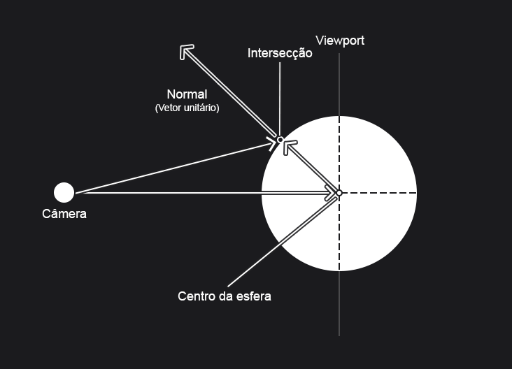
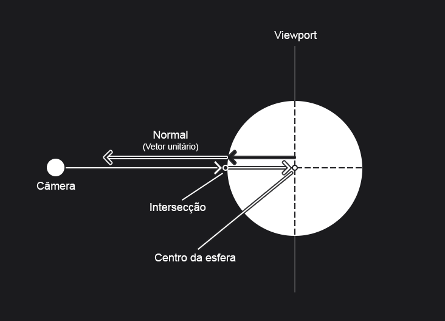
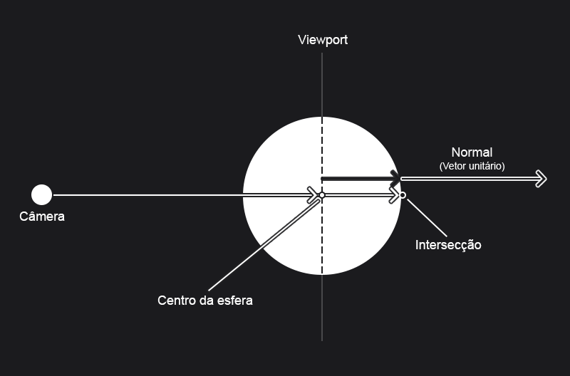
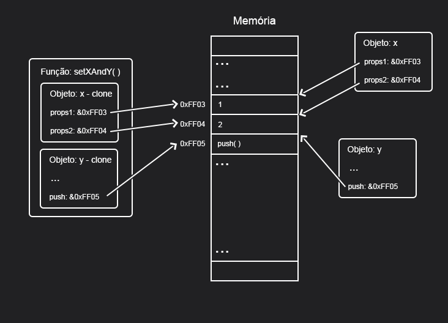

# Capítulo 6 - Surface Normals and Multiple Objects

Nesse capítulo grandes partes das mudanças serão para melhorar a implementação do código que atualmente encontra-se extremamente acoplado em uma única função, mas como ainda não foi definido materias e comportamentos de reflexão, uma implementação simples para visualização da esfera em volume será utilizada e auxiliará nos capítulos seguintes.

## Vetores normais

A subtração do vetor de direção e ponto de centro da esfera (que pode ser entendido como um vetor) não funcionou na descrição da superfície da esfera, mas agora com o uso do $t$ é possivel representar com assertividade o ponto de contado do raio com a esfera, tornando a subtração muito útil para determinação da normal:



Note que o autor optou por tornar o vetor normal unitário devido a facilidade, já que se sabe que o tamanho do vetor é igual ao raio da esfera e a utilidade nos próximos capítulos. Isso aumentou o tamanho do vetor normal que foi dividido por 0.5 (multiplicado por 2).

## Faces Frontais e Faces Posteriores

Apesar de não serem utilizadas nesse capítulo, tendo uso somente no **Capítulo 10 - Metal**, o conceito de faces frontais e faces posteriores foi introduzido e implementado, visando saber se o raio atinge o objeto de fora para dentro ou de dentro para fora. Isso é importante pois diversos objetos possuem propriedades diferentes dado o lado (dentro ou fora) quando são atingidos pela luz.

Nessa comparação é usado o produto escalar (*dot product*), isso ocorre pois como ele pode ser entendido como a multiplicação do tamanho de um vetor pelo tamanho da projeção do segundo vetor na linha do primeiro vetor, caso essa multiplicação seja negativa esses vetores possuem direções opostas, caso contrário possuem a mesma direção.

Um exemplo de face frontal é a imagem a baixo, veja que o raio é contrário ao vetor normal. É importante perceber que os vetores de subtração e normal foram deslocados para cima para evitar a sobreposição e facilitar o entendimento:



Contrário ao exemplo a cima, faces posterior teram seu vetor normal no mesmo sentido do raio, assim sendo parecidas com a imagem a baixo que novamente foi deslocada para melhorar o entendimento, mas permitindo que o vetor de raio e centro da esfera se sobreponham:



## Funcionamento da linguagem Javascript

Como o autor dedicou um subcapítulo para falar sobre recursos disponíveis da linguagem C++, usarei essa anotação para justificar as mudanças mais notáveis de código. 

Como método para utilizar mais eficientemente a memória, evitando duplicações desnecessárias, o código em C++ usa passagem de parâmetros por referência algumas vezes (indicando a posição na memória na passagem por parâmetro). O exemplo mais claro ocorre no uso do objeto *hit_record* passado para função *hit* da classe *HittableList*.

Nesse método o autor verifica linearmente cada um dos objetos em cena visando encontrar um objeto que seja tocado por um determinado raio e tenha maior proximidade com a câmera. Dessa forma, cada vez que um objeto é encontrado a distância que o raio deve percorrer para encontrar outros objetos deve ser menor que a de interseccção.

Para isso o autor cria um *hit_record* temporário com o objeto mais próximo obtido até o momento (tendo a distância máxima como infinita na primeira interação) e atribui esse ao *hit_record* passado por parâmetro.

Apesar disso, tal procedimento é impossível em Javascript já que a passagem por referência explícita é inexistente (ou quase isso) na linguagem. Por conta disso, é preciso recorrer a outros métodos.

### Funcionamento dos parâmetros em Javascript

De maneira geral pode-se dizer que em Javascript todos os parâmetros são passados por valor, ou seja, seu valores são copiados para um clone desse objeto que só existe dentro do escopo da função.

```typescript
let x = 1

console.log(x)
// Output: 1

function setX(x: number): void{
    x = 2
}

setX(x)

console.log(x)
// Output: 1
```

Como visto a cima, o *x* da função *setX* só existe dentro da função e por ser um clone da variável global *x* não altera seu valor e é excluido pelo *garbage collector* da linguagem após o termino da função.

### Objetos e Classes como parâmetros em Javascript

```typescript
const x = { prop1: 1, prop2: 2}
const y: number[] = []

console.log(x)
//Output: {"prop1": 1, "prop2": 2}
console.log(y)
//Output: []

function setXAndY(x: Record<string, number>, y: number[]): void{
    x.prop1 = 3
    y.push(1)
}

setXAndY(x, y)

console.log(x)
//Output: {"prop1": 3, "prop2": 2} 
console.log(y)
//Output: [1]
```

O exemplo a cima pode causar uma pequena confusão. Os objetos não são passados por valor? Como pode o objeto ser modificado em uma função se ela só modifica os clones desses objetos? Javascript possue ou não passagem de parâmetros por referência?

A melhor forma de explicar isso é ressaltando, **Javascript não possue passagem de parâmetros por referência**. Dessa forma, para explicar o comportamento a cima é preciso entender melhor sobre [**Estratégia de avaliação**](https://pt.wikipedia.org/wiki/Estrat%C3%A9gia_de_avalia%C3%A7%C3%A3o), conjunto de regras que define como os parâmetros de uma função serão atribuidos.

Linguagens como Java, Javascript, Python, Ruby e outros utilizam a **passagem de parâmetros por compartilhamento**. Essa estratégia é muito parecida com a passagem por valor, já que um clone do objeto é criado, mas mantêm as referências do objeto original, como atributos e funções, em memória.



Dessa forma, uma mudança diretamente na memória altera tanto o objeto clone quanto o objeto original. Apesar disso, é impossível reatribuir o objeto original através do clone, visto esse foi feito por valor, invalidando uma parte do código:

```C++
    rec = temp_rec;
```

## Soluções

### Referência em um Objeto

Uma das soluções é criar um objeto que faça referência ao *hit_record* original, permitindo mudanças diretamente na memória:

```typescript
const obj = { rec: new HitRecord() }

hit(ray: Ray, ray_t: Interval, obj: {rec:HitRecord}): boolean {
    const tempRec = new HitRecord();
    let hitAnything = false;
    let closest_so_far = ray_t.max;

    for (const object of this.objects) {
      if (object.hit(ray, new Interval(ray_t.min, closest_so_far), tempRec)) {
        hitAnything = true;
        closest_so_far = tempRec.t;
        obj.rec = tempRec
      }
    }

    return hitAnything;
}
```

### Método de modificação

Outra solução é criar um novo método na classe *HitRecord* que mude os valores do objeto original:

```typescript

export class HitRecord {
 ...

  setValues(object: HitRecord) {
    this.p = object.p;
    this.normal = object.normal;
    this.t = object.t;
    this.frontFace = object.frontFace
  }
}


hit(ray: Ray, ray_t: Interval, rec: HitRecord): boolean {
    const tempRec = new HitRecord();
    let hitAnything = false;
    let closest_so_far = ray_t.max;

    for (const object of this.objects) {
      if (object.hit(ray, new Interval(ray_t.min, closest_so_far), tempRec)) {
        hitAnything = true;
        closest_so_far = tempRec.t;
        rec.setValues(tempRec);
      }
    }
    return hitAnything;
}
```

### Ignorar a Passagem por Referência

A forma adotada nesse projeto é ignorar a passagem por referência e retornar o valor diretamente da função que retornará *null* ou o objeto desejado.

```typescript
interface IHittable {
  hit: (ray: Ray, ray_t: Interval) => HitRecord | null;
}

class HittableList implements IHittable {
  ...
  hit(ray: Ray, ray_t: Interval): HitRecord | null {
    let tempRec = new HitRecord();
    let hitAnything = false;
    let closest_so_far = ray_t.max;

    for (const object of this.objects) {
      const recHitObject = object.hit(
        ray,
        new Interval(ray_t.min, closest_so_far)
      );

      if (recHitObject != null) {
        hitAnything = true;
        closest_so_far = tempRec.t;
        tempRec = recHitObject;
      }
    }

    return hitAnything ? tempRec : null;
  }
}
```


