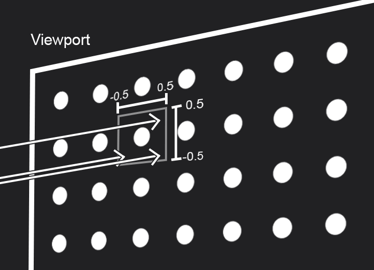

# Capítulo 8 - Antialiasing

Um dos problemas das imagens geradas nos capítulos anteriores era o serrilhamento, esse efeito ocorre pela interpretação do pixel através de uma única amostra, impossibilitando a interpolação de cores e canais que ocorre na transição de um objeto para outro (efeito que suaviza a visualização da cena).

Para resolver isso, é necessário recolher um número maior de amostras para um único pixel. Esse processo encontrará todo o contexto daquele pixel, não usando somente um vetor no centro do mesmo para descrever a cor, obtendo mais informações e gerando um resultado mais preciso.

Apesar disso, pode ocorrer uma interpretação errada pelas imagens contidas no livro. As amostras são recolhidas através de um único pixel, e não de pixels ao redor do pixel alvo. Por isso, o alcance dos valor de deslocamento do raio estão entre -0.5 e 0.5 (distância de 1 pixel), isso quer dizer que o valor anteriormente no centro do pixel será deslocado por um valor aleatório dentro desse alcance.

O livro usa o parâmetro *samplePerPixel* na classe *Camera* para controlar a quantidade de amostras desejadas, onde cada uma terá o valor de deslocamento aleatória, parecida com a imagem a baixo:

Observe que caso ambos os valores sejam 0 o raio estará na posição central, representado pelo círculo branco no centro.

Além disso, como obtemos varias informações para cada pixel, é preciso fazer uma média entre todos os dados, essa média resultará na cor definitiva que será mostrada na imagem final.

Esse processo, além de produzir antisserrilhamento, abrirá portas para outras técnicas implementadas no final do livro, como o desfoque.

## Observações

Nas notas do **Capítulo 4 - Rays, a Simple Camera, and Background** na seção de **Observações** foi levantada a possibilidade de manter o raio no canto superior esquerdo do pixel caso fosse assim desejado (não implementando o deslocamento para o centro). Isso irá influenciar o alcance de deslocamento para obtenção das amostras, visto que dessa forma um deslocamento negativo estaria fora do pixel.

Uma opção é mudar o alcance para valores entre 0 e 1, obtendo amostras de todo o espaço do pixel, já que o deslocamento máximo em ambos os eixos mudará o raio do canto superior esquerdo para o inferior direito.