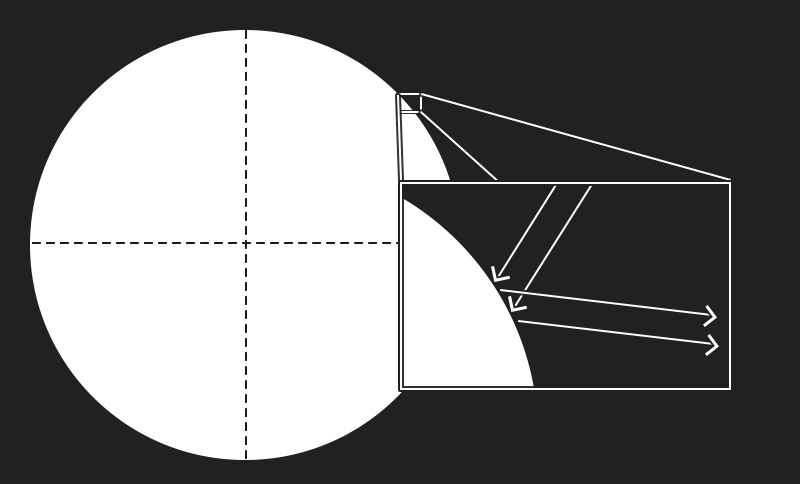
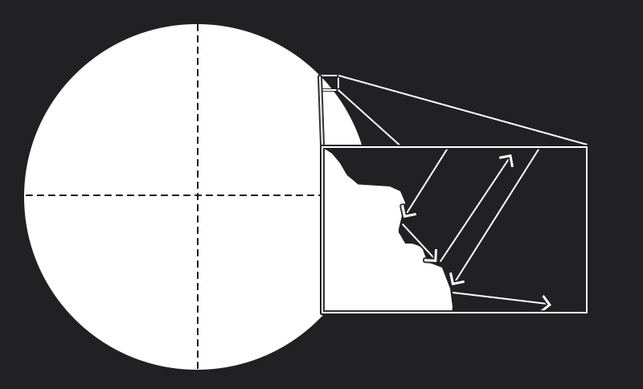
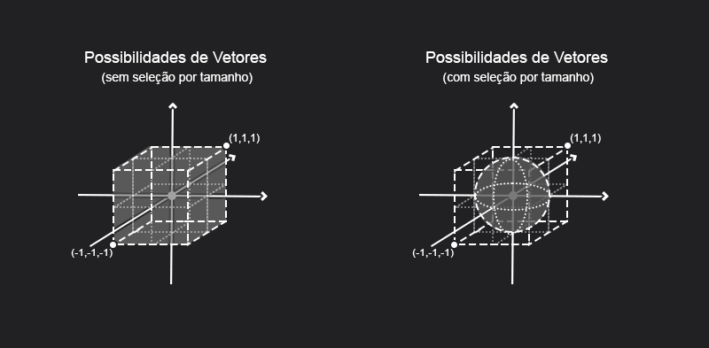
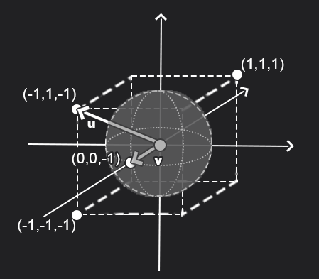
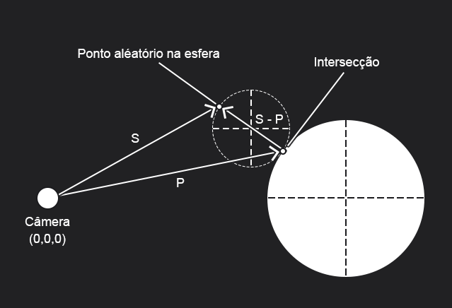
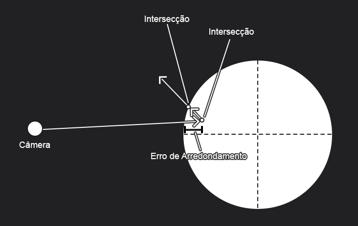

# Capítulo 9 - Diffuse Materials

Esse capítulo visa a implementação da reflexão de um material difuso. Talvez a primeira dúvida seria **O que é um material difuso?**

## Materiais Difusos

Seguindo o livro, *"materiais difusos não emitem a própria luz e reflete luz em direções randômicas""* (tradução livre). Apesar disso ser verdade, isso não deixa a ideia clara do que é um material difuso, afinal não é assim que normalmente classificamos materiais.

A primeira coisa a ser citado é que estamos falando sobre reflexão de luz, ou seja, a forma com que o objeto interage com os raios de luz que chegam em sua superfície, nesse ponto uma informação útil é como é a superficie desse objeto.

Uma superfície pode ser extremamente áspera e irregular,extremamente lisa e polida ou uma varição entre essas duas possibilidades, a forma com que a luz interege de forma microscópia com os relevos ou a falta deles altera a forma com que visualizamos um objeto.

Superfície Polida possuem uma reflexão previsível:

Um material difuso por sua vez é uma superfície áspera, por isso quando diversos raios de luz atingem um objeto e interagem com suas irregularidades é impossível prever a direção com que eles serão refletido devido as características intrínsecas daquele pedaço microscópico do objeto.

## Vetor Randômico Aleatório

Até o momento não possuimos nenhuma maneira de gerar vetores randômicos aleatórios, devido a isso o livro cria a implementação de uma função utilitária com esse objetivo.

Apesar disso, essa implementação conta com algumas sutilezas que não são encontradas no livro, apesar desse capítulo em específico ser muito bem ilustrado. Uma delas está na seleção de candidatos a vetor aleatório.

Na código, geramos três números aleatórios entre -1 e 1 e atribuimos cada um deles aos eixos (x, y, z) de um vetor. Por fim **verificamos seu tamanho** e, caso seja menor que 1, normalizamos e retornamos seu valor, caso contrário esse vetor é descartado , outro vetor é gerado e o processo reinicia.

Uma pergunta que pode ser levantada é o porque dessa verificação de tamanho, iremos normaliza-lo depois, então pra que essa seleção? Qualquer vetor quando normalizado atenderia ao requisito de tamanho igual à 1.

Para responder isso é preciso sair um pouco do mundo de álgebra linear e computação gráfica e pensar em probabilidade. Como muito bem esclarecido na [discussão](https://github.com/RayTracing/raytracing.github.io/discussions/941), essa seleção tem como objetivo igualar as probabilidades de todos os vetores de serem encontrados no domínio. Veja na imagem a abaixo a comparação:

Um exemplo de probabilidade desequilibrada pode ser visto a baixo:

O vetor **u** tem tamanho $\sqrt{3}$ e o vetor **v** tem tamanho $1$, essa diferença podem ser encarada como a diferença de probabilidade, já que a diferença de pontos discretos que podem ser interpretados em um double (ou float) é maior no intervalo $0$ a $\sqrt{3}$ do que no intervalor $0$ a $1$ ($\approxeq 1.7$ vezes maior). Veja também que o vetor **v** é o vetor máximo para o vetor unitário ($0$,$0$,$-1$), mas **u** não é o vetor máximo para o vetor unitário ($-1/\sqrt{3}$, $1/\sqrt{3}$, $-1/\sqrt{3}$).

Devido a isso, é necessário a seleção previa de vetores com tamanho menores que 1, garantindo que esses estejam em um domínio com probabilidades equilibradas para todos os casos.

## Implementação

O livro apresenta dois tipos de implementação, por hemisfério e por Reflexão Lambertiana, e mostra as diferenças entre cada método. De maneira geral, a implementação de Reflexão Lambertiana será a utilizada pelo resto do livro, isso ocorre por essa ser mais realista, já que o raio são mais propensos a serem refletidos na direção da normal já que poucos vetores aleatórios podem refletir raios perpendiculares à normal, diferente do método de hemisfério.

Apesar disso, a explicação presente no subcapítulo **"True Lambertian Reflection"** é um pouco diferente da implementação em si. Na imagem a baixo vemos que como o autor descreve, o vetor de direção da reflexão pode ser obtido por S - P.

Essa explicação exige que o vetor S seja encontrado, mas atualmente só temos um simples vetor unitário randômico. Mesmo com isso, o código em si usa uma estratégia mais simples e eficiênte para determinar a direção que consiste em somar esse vetor ao centro do esfera de apoio (dado pelo vetor normal unitário do ponto do objeto esfera).

## Erros de Arredondamento no Contato do Raio

Devido à natureza de aproximação de floats e doubles, os números decimais podem ser apenas parcialmente representados, isso acontece pelo limite máximo no número de casas decimais dessas primitivas. Por causa disso, existe um erro de arredondamente no ponto de contato do raio com um objeto.

Esse erro pode causar situações chamadas de acne de sombra, onde o ponto de intersecção é encontrado fora da superfície de contato (pelo lado de fora ou de dentro), o que acarreta uma dupla contagem de reflexão da cor (as vezes mais do que duas), tornando esse ponto mais escuro do que os pontos ao redor, como no exemplo:

Para resolver isso é colocado um valor de limite mínimo do objeto *Interval*, não permitindo que o valor de $t$ seja demasiadamente pequeno, evitando os erros de arredondamento.

## Correção de Gamma

A correção de gamma é um procedimento que visa tornar linear o brilho com qual as cores são representadas em um monitor. Diferente do que se pensa, dobrar a potência de um monitor não dobra o brilho que esse monitor produz, mas ,ao invés disso, faz com que o brilho escale através de um função quase quadrática ($\approxeq x^{2.2}$). Com isso, ao dobrar a intensidade de uma canal (que em nosso caso vai de 0 até 1) o valor gerado na tela pode ser até quase 5 vezes mais intenso que o valor esperado, devido a diferença do comportamento linear do código e quadrático do monitor.

Para resolver isso uma função inversa pode ser aplicada ($\approxeq x^{\frac{1}{2.2}}$) para reverter essa característica dos monitores, tornando a brilho e intensidade da cor linear.

# Observações

É importante resaltar que a partir desse capítulo as imagens de saída dos capítulos passados, caso executados novamente, seram diferentes, já agora será aplicada a correção de gamma que normalmente gera imagens mais claras. Caso queira que seu *output* saia exatamente da mesma forma que nos capítulos passadas basta modificar a função **linearToGamma** em **JimpLib.ts**, fazendo que ela retorne o próprio valor obtido ou simplesmente removendo sua chamada do código.

Para saber mais sobre a correção do gamma:

- [LearnOpenGL](https://learnopengl.com/Advanced-Lighting/Gamma-Correction)
- [Cambridge In Color](https://www.cambridgeincolour.com/tutorials/gamma-correction.htm)

